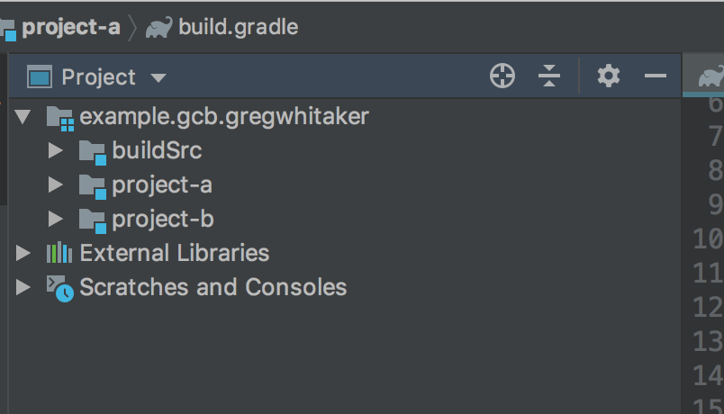

# gradle-monorepo-example

An example of building projects in a monorepo using [Gradle Composite Builds](https://docs.gradle.org/current/userguide/composite_builds.html) that share a common [buildSrc](https://docs.gradle.org/current/userguide/organizing_gradle_projects.html#sec:build_sources).

NOTE: After further investigation and attempts to make this work on a larger, more complex, project it appears that buildSrc on composite builds is not a fully supported feature at this time and YMMV with this approach. Based on Gradle docs it appears that official support for this functionality is in the works.

## Repository Structure
The repository contains four projects each with their own Gradle configurations.

Projects A, B, and C have dependencies on one another:

    [project-a] -- DEPENDS --> [project-b] -- DEPENDS --> [project-c]
    
Project D has no dependencies on the other projects:
    
    [project-d]
    
All four projects also have access to the common `buildSrc` directory where they can get tasks and plugins that are
shared amongst them.

## Running the Example
Follow the steps below to run the example:

### Run `hello` Task in Project A
Run the following commands to build [project-a](project-a):

1. Change the working directory to [project-a](project-a):

        cd project-a
        
2. Run the following command to execute the hello task:

        ./gradlew hello

    If successful, you will see the following in the console:
    
        > Task :hello
        Hello from task :hello!
        
### Run `hello` Task in Project D
Run the following commands to build [project-d](project-d):

1. Change the working directory to [project-d](project-d):

        cd project-d
        
2. Run the following command to execute the hello task:

        ./gradlew hello

    If successful, you will see the following in the console:
    
        > Task :hello
        Hello from task :hello!
                
## Working in IntelliJ
IntelliJ supports Gradle Composite Builds and will automatically open any included builds for a project.

To see this in action, open [project-a](project-a) in your IntelliJ IDE. You will notice that IntelliJ automatically
opens [project-b](project-d) as well as the [buildSrc](buildSrc) project because they are both dependencies of the
current project.

## Bugs and Feedback
For bugs, questions, and discussions please use the [Github Issues](https://github.com/gregwhitaker/gradle-monorepo-buildsrc-example/issues).

## License
MIT License

Copyright (c) 2019 Greg Whitaker

Permission is hereby granted, free of charge, to any person obtaining a copy
of this software and associated documentation files (the "Software"), to deal
in the Software without restriction, including without limitation the rights
to use, copy, modify, merge, publish, distribute, sublicense, and/or sell
copies of the Software, and to permit persons to whom the Software is
furnished to do so, subject to the following conditions:

The above copyright notice and this permission notice shall be included in all
copies or substantial portions of the Software.

THE SOFTWARE IS PROVIDED "AS IS", WITHOUT WARRANTY OF ANY KIND, EXPRESS OR
IMPLIED, INCLUDING BUT NOT LIMITED TO THE WARRANTIES OF MERCHANTABILITY,
FITNESS FOR A PARTICULAR PURPOSE AND NONINFRINGEMENT. IN NO EVENT SHALL THE
AUTHORS OR COPYRIGHT HOLDERS BE LIABLE FOR ANY CLAIM, DAMAGES OR OTHER
LIABILITY, WHETHER IN AN ACTION OF CONTRACT, TORT OR OTHERWISE, ARISING FROM,
OUT OF OR IN CONNECTION WITH THE SOFTWARE OR THE USE OR OTHER DEALINGS IN THE
SOFTWARE.
